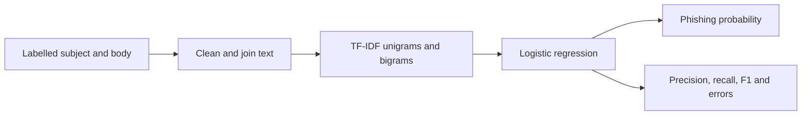

# PhishGuard

PhishGuard is a small, explainable machine-learning project that classifies
email text as legitimate or phishing-like. It joins the subject and body,
turns the words into TF-IDF features, and trains a logistic-regression model.

The repository is designed as an educational experiment, not a production
spam filter. It uses 240 harmless synthetic messages so the complete workflow
can be reproduced without downloading personal email or following unsafe links.

## Research question

> Can a transparent linear text classifier separate phishing-like language
> from ordinary email in a controlled synthetic dataset, and what can its
> errors and feature weights tell us?

## How it works



TF-IDF gives more weight to terms that are important in one message but not
common everywhere. Logistic regression learns one weight for each term. A
positive weight supports the phishing class and a negative weight supports the
legitimate class, which makes the result easier to inspect than a black-box
model.

## Reproduce the experiment

Python 3.11 or newer is recommended.

```powershell
python -m venv .venv
.venv\Scripts\Activate.ps1
python -m pip install -r requirements.txt
python scripts/build_demo_dataset.py
python run_experiment.py
python -m pytest
```

Launch the dashboard with:

```powershell
streamlit run app.py
```

`run_experiment.py` keeps 25% of the messages out of training, reports
accuracy, precision, recall and F1, and saves predictions in `results/`. The
random seed and class balance are fixed so that the demonstration is
repeatable.

## Repository layout

```text
phishguard-ml/
|-- phishguard/
|   |-- data.py
|   |-- evaluation.py
|   `-- model.py
|-- scripts/build_demo_dataset.py
|-- data/messages.csv
|-- tests/
|-- app.py
`-- run_experiment.py
```

## Interpreting the metrics

- **Precision:** of the messages flagged as phishing, how many were phishing.
- **Recall:** of the phishing messages, how many the model found.
- **F1:** a balance between precision and recall.
- **False positive:** a legitimate message incorrectly blocked.
- **False negative:** a phishing message allowed through.

In email security, the costs differ. False positives interrupt legitimate
work, while false negatives can expose a user to fraud. The best threshold
depends on the deployment rather than accuracy alone.

## Limitations

- The messages are synthetic and contain relatively clear language patterns.
- Similar templates occur in training and test data, making the held-out task
  easier than genuine email from new organisations and attackers.
- The project evaluates text only; it does not inspect URLs, attachments,
  sender reputation, headers or domain age.
- Attackers can paraphrase messages and deliberately avoid known terms.
- A score from this dataset is a software-pipeline check, not evidence of
  real-world detection performance.

## Sensible next steps

- Evaluate without retraining on a licensed public email dataset.
- Split data by campaign or sender to test generalisation.
- Tune the probability threshold using the cost of each error type.
- Compare word features with character n-grams for obfuscated text.
- Add calibration and a short model card.

For a file-by-file explanation and interview questions, see
[`docs/INTERVIEW_GUIDE.md`](docs/INTERVIEW_GUIDE.md).

## Responsible use

The examples use fictional messages and contain no live links. Do not upload
private email to this demonstration. A practical security system needs current
data, monitoring, privacy controls and human review.

